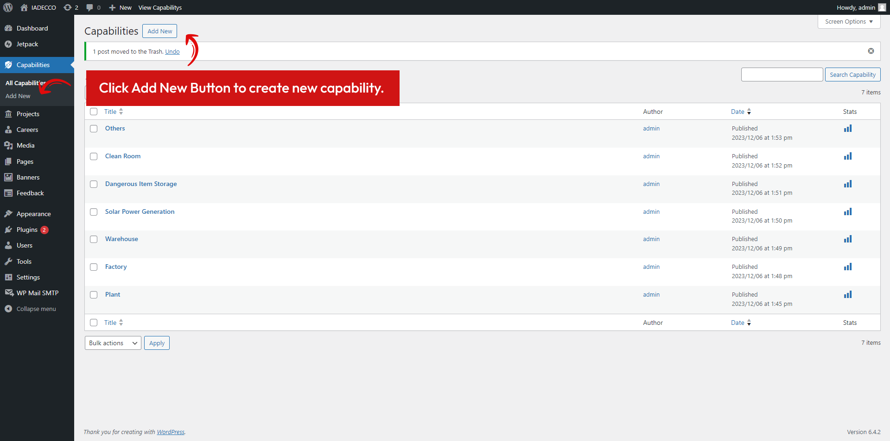

# 7. Add Delete & Modify Capabilities

Navigate to **Capabilites** menu in admin panel.

<figure>
   

      
   

</figure>

## 7.1 Adding New Capability

To add new Project, navigate to **Capabilities > Add New**, and do following steps:

<figure>
   

      
   

</figure>

Adding title, description, and featured image.

<figure>
   

      
   

</figure>

## 7.2 Delete & Edit Existing Capability

To delete or edit existing capability, navigate to menu **Capabilities > All Capabilities**

1. Look for Capability Table list, and find capability you want to delete/edit by hover the column
   <figure>
      

         
      

   </figure>
2. Find button `Trash` to delete or `Edit` to edit existing capability.
3. Your selected capability item will automatically deleted.

!> Be mindful about deleting your capability item. It will instantly take action and not showing warning notification before taking action.

?> To undo action, interface will showing **Undo Action**

   <figure>
      

         
      

   </figure>
