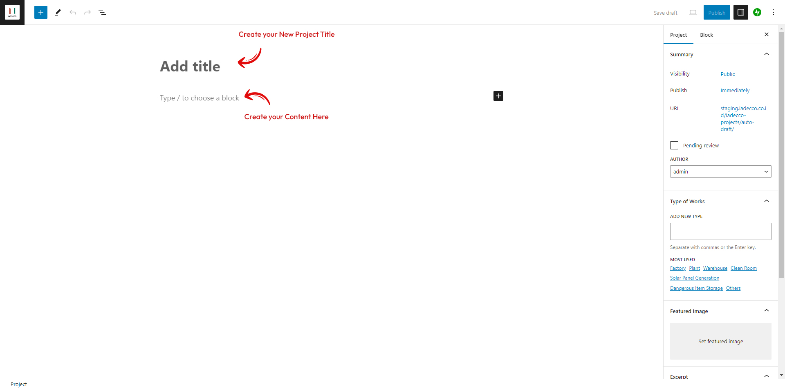
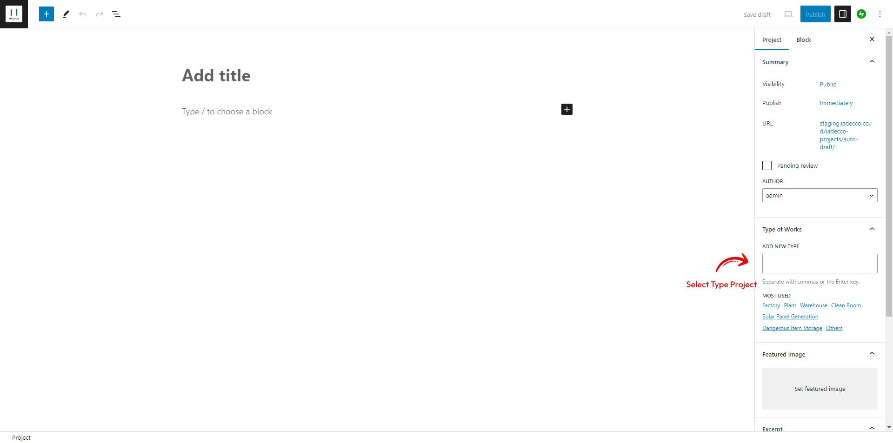
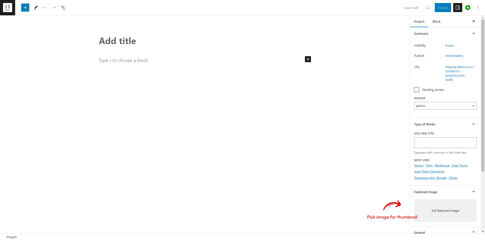
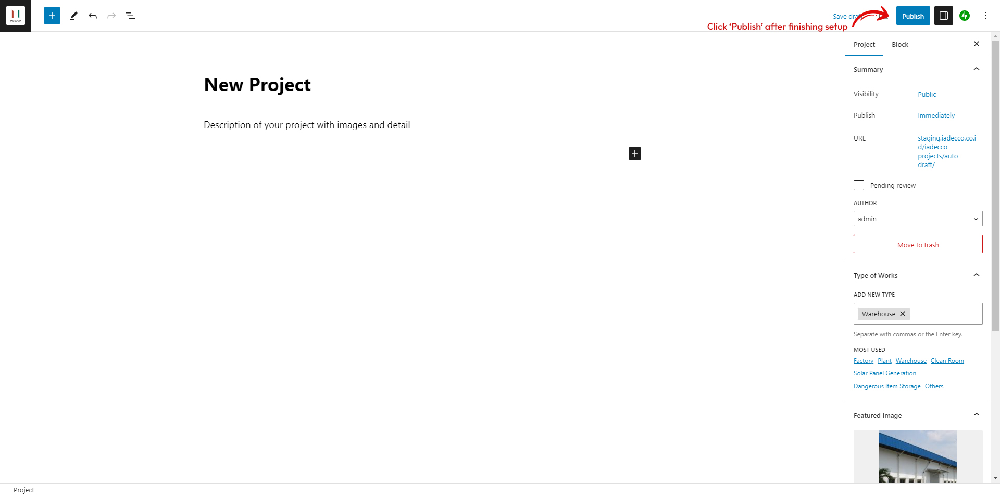
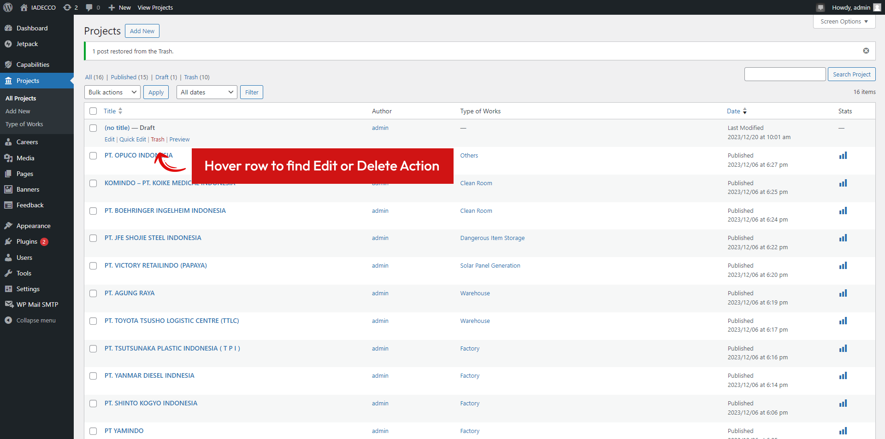
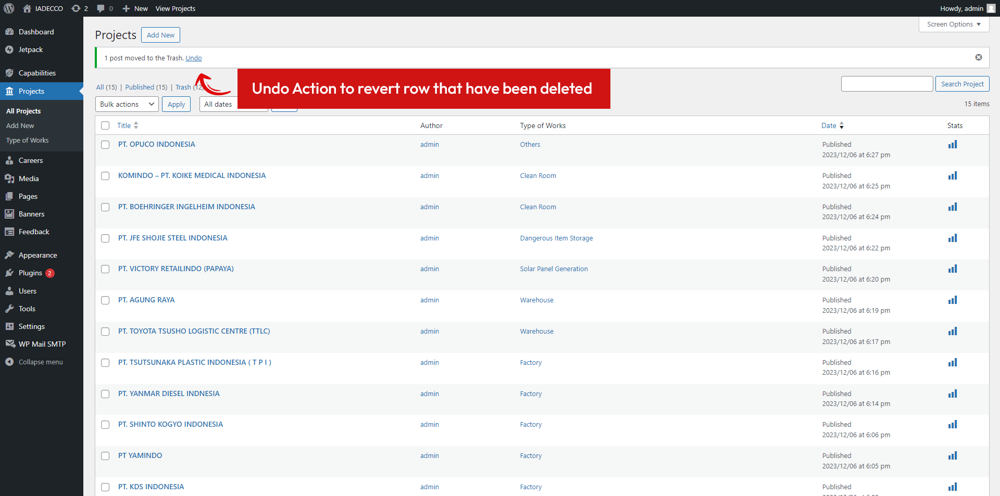
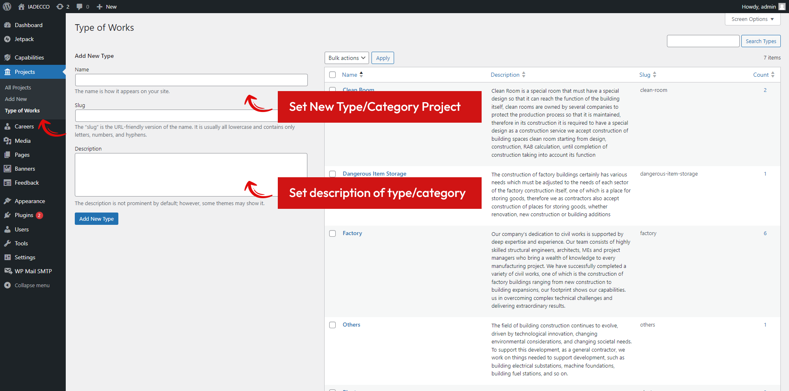
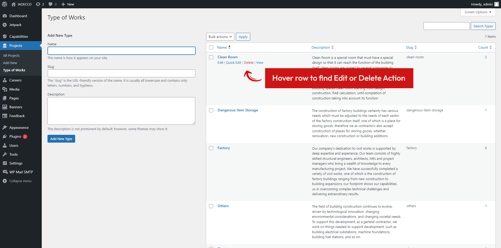

# 5. Add Delete and Modify Project

## 5.1 Adding New Project Item

To add new Project, navigate to **Projects > Add New**, and do following steps:

1. Add Title and type description
   <figure>
      

         
      

   </figure>
2. Adding Type of Work
   <figure>
      

         
      

   </figure>

   [What is Type of Work?](#_54-type-of-works)

3. Set Featured Image
   <figure>
      

         
      

   </figure>
4. Publish Your New Project or save it as a draft
   <figure>
      

         
      

   </figure>

## 5.2 Delete Project Item

To delete project, navigate to menu **Projects > All Projects**

1. Look for Project Table list, and find project you want to delete by hover the column
   <figure>
      

         
      

   </figure>
2. Find button `Trash` and click it.
3. Your selected project item will automatically deleted.

!> Be mindful about deleting your project item. It will instantly take action and not showing warning notification before taking action.

?> To undo action, interface will showing **Undo Action**

   <figure>
      

         
      

   </figure>

## 5.3 Modify Project Item

To modify project that you already created, navigate to menu **Project**

1. Look for Project Table list, and find project you want to modify by hover the column
2. Find button `Edit` and click it.
3. You will be navigate to Edit Page and you can modify it as you like.
4. Don't forget to Update your Project by clicking Update button on the top right corner of the screen

## 5.4 Type Of Works

Type of Works is an alias name for category project. By Default, type of works consist of Warehouse, Plant, Others, Factory, Dangerous Item Storage, Clean Room.

### 5.4.1 Add New Type of Works

To add new Type of Works:

1. Navigate to **Projects > Type of Works**
2. Add New Name and Description
3. Click button `Add New Type`

<figure>
   

      
   

</figure>

?> Slug Name field is automatically created if you not defined. Recommend to leave it blank and let wordpress to do the work.

### 5.4.2 Edit and Delete Type of Works

To add Edit and delete Type of Works:

1. Navigate to **Projects > Type of Works**
2. Hover the selected rows in Type of Works table to find the Edit and Delete Button
3. Click button `Edit` to edit or `Trash` to delete the selected record.

<figure>
   

      
   

</figure>
